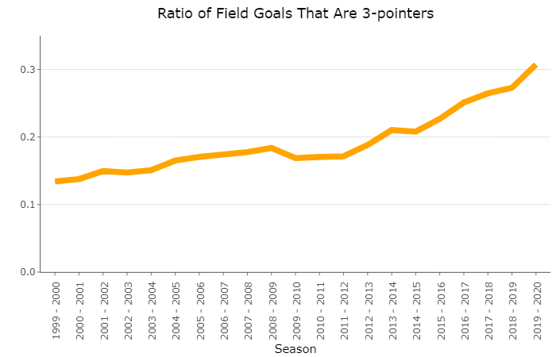
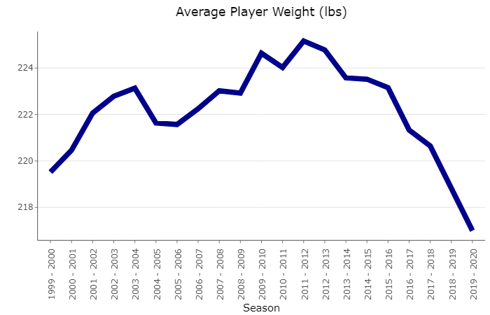
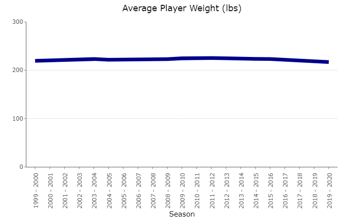

# Is The NBA Shrinking?

##### Connor Fairbanks
##### March 20, 2021

___

Is the average basketball player in today's NBA shorter than the average players were 10, 20, or 30 years ago?

  

This seems like an easy question to answer. You simply measure the player's heights and look at the average of those measurements each year. You might even make it into a nice chart which would show the trend of this height change over time. In this article, I will demonstrate that in the world of data visualization, things are never quite that simple. 

## The rise of the three ball, the fall of the big man

In recent years, the NBA has seen an increase in the proportion of shots that are three pointers (as opposed to shorter distance 2-point shots). Let's take a look at all the shots in the NBA since 1999. By taking all of the shots that were 3-pointers and dividing that by the total shots taken, we can find the proportion (percentage) of shots that are 3-pointers. 

  

This chart displays the proportion of the player shots (Field Goals) that are 3-pointers for each season in the NBA. By 2020 over 30% of all shots are 3-pointers 

The line graph above does a great job of showing how trends change over time. everyone is able to see that more shots are being taken from behind the 3-point line in recent years. One reason for this observed trend is the increased use of data analytics in professional basketball.

Long distance shots (like 3-pointers) are worth more than short distance shots because they are more difficult to make. A player is rewarded an extra point for the extra difficulty. The use of data analysis has helped teams realize that the benefit of scoring 3 points on a single shot outweighs the increased risk of missing the shot. In the end, every team wants to score the most points, and shooting more 3-pointers is an effective way for teams to score points. 

Any basketball fan will quickly notice a pattern arise in a game when it comes to player heights. Taller players tend to play near the basket where they can use their size advantage to rebound missed shots and score at close range to the hoop. Shorter players use their speed and agility to find open spaces where they can shoot. These patterns result in shorter players often being farther away from the basket, shooting the most 3-pointers. 

If the NBA is shooting more 3-pointers, does that mean that there are more short players in the NBA?

Let's see what the data shows.

## NBA player size dropoff

For this portion of our analysis, we are going to make a simple assumption. We are assuming that on average, bigger/taller players (who play near the hoop) weigh more than quicker/smaller 3-point shooting players. Even if taller players are also shooting more 3-pointers, they would need to run more to get to 3-point shooting positions, so they would likely weigh less than big men who stay parked near the hoop all the time. 

With that assumption in mind, we can get an idea of how the rise of 3-point shooting is affecting the average weight of players in the NBA. By measuring the weight of each player and finding the average of all the measurements, we can see the average player weight each season.  

  

The average player weight (in pounds) of NBA players each season. In recent years, we see a steep decline in player weight.   

Right around the 2012-2013 season we see a **steep** decline in average player weight. Sure enough this is right around the time we saw an increase in the percentage of 3-pointers being shot in our graph from earlier. 

It would appear that the average player is getting smaller, and we have a good idea of why this is happening. 

Great! Question answered! 

Are you sure you want to go with that answer?

## The magic of data manipulation

Before we get too far ahead of ourselves, let's take another look at that player weight data. The chart below is made from the same player weight data we saw earlier, collected in exactly the same way. 

  

The average player weight (in pounds) of NBA players each season. This graph has the y axis starting at zero.

That is the same data? Really?

  

Yes it is the same data. The only difference between the two charts is the scale of the y-axis. The y-axis (the vertical axis of the chart) is labelled with the weight of the players. When the y-axis does not start at zero, we are essentially zooming in on the graph to the point where we only see the range of weight values on the y-axis. 

## Which chart is better?

In most cases, the second weight chart is much better. When we start the y-axis at zero, we get a true representation of the weight comparison between years. When the y-axis is shortened, humans tend to miss the axis labels and read the data inaccurately. For instance, the first weight chart may lead us to believe that NBA players in the year 2020 weigh half as much as players did in 2000. This obviously isn't true.

The only reason the shortened y-axis chart would be useful is if small changes in that axis were really important to notice. In our case, it doesn't matter if a player weighs 200 lbs instead of 201 lbs, so we should use the "zero" y-axis. If you invested $1,000,000 in a stock, and charted the price of that stock, a 1% change would make a substantial difference in the amount of money in your portfolio, so you would want to use the shortened y-axis.

## The lesson

The lesson is, be careful when viewing the next random graph that your uncle posts on Facebook. Data can be manipulated to tell a biased story, when its true purpose should be to uncover the facts.  

## The answer

So are NBA players shrinking? 

Technically yes. 

Does it matter? 

No. The decrease in weight is so small that the difference is insignificant. 

